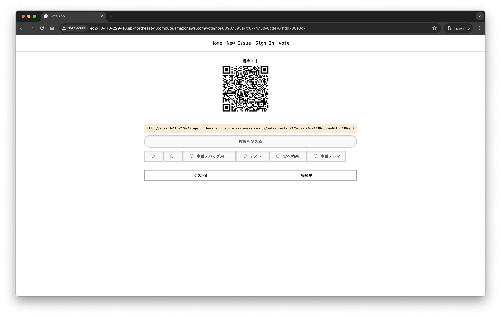
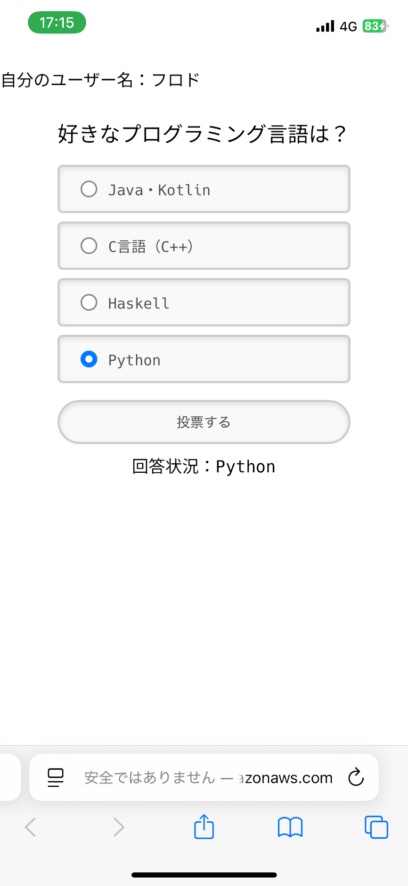
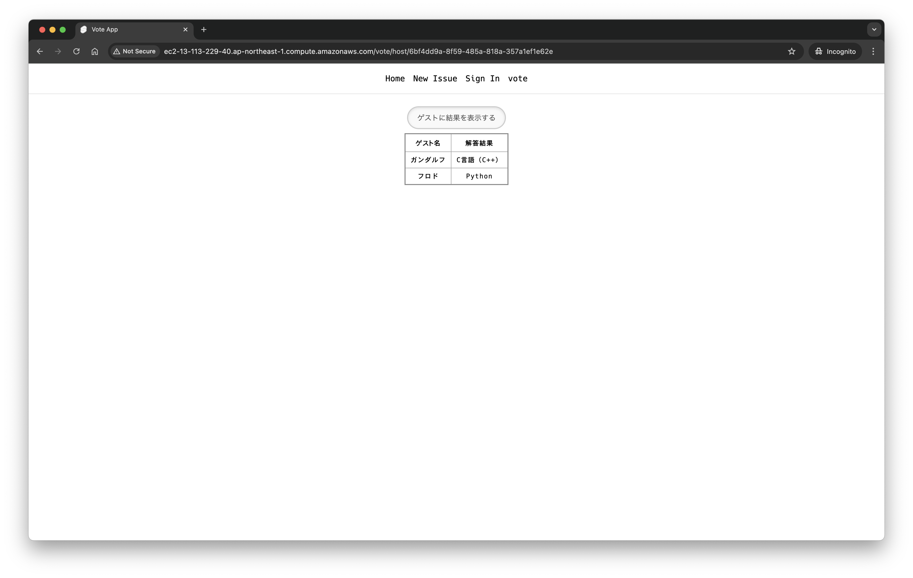
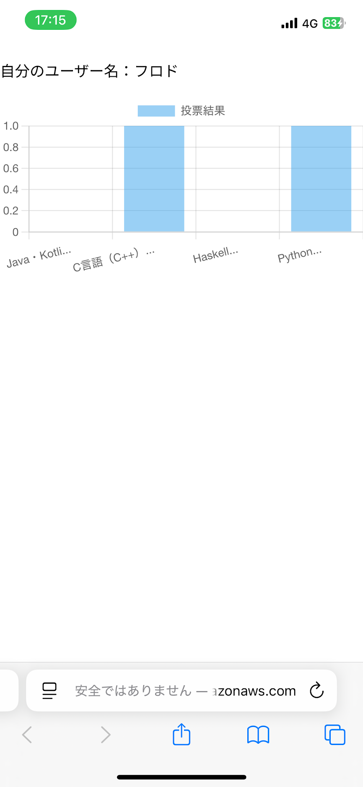
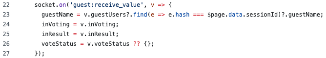
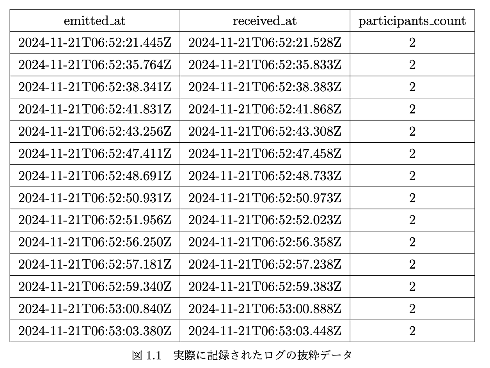
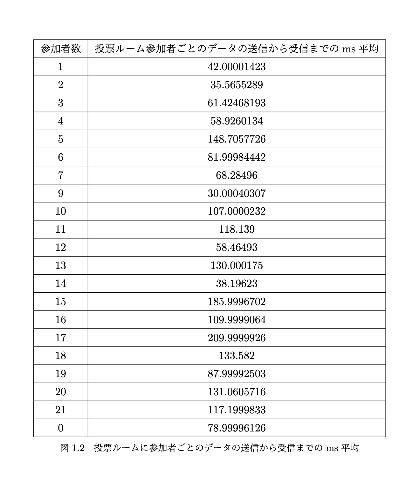

## WebSocketを用いた双方向通信を実現するWebアプリケーションの開発手法とその検証

### 発表者: 儀賀真周
### 所属: 神奈川大学 理学部 情報科学科
### 発表日: 2025/02/13
<!--
---
# 目次

1. 研究背景
2. 研究目的
3. 作成したWebアプリケーション
   - 実際の画面
3. 研究方法
4. 結果
5. 考察
6. 結論
-->

---
# 研究背景
## 不可欠な通信プロトコル HTTP と課題

- HTTP通信はハイパーテキスト文章・画像・動画・PDFなど、さまざまなメディアタイプでのデータの受け渡しを**Web上で行うことが可能**
→ 欠かせない通信技術の一つ

- リモート会議・講義など遠隔でリアルタイムな通信も求められる時代となった
→ HTTPは通信設計上リアルタイムの通信には不向き
（常に通信するのではなく、リクエスト駆動形式で通信を開始するたびに接続の確立を行うため、リアルタイム通信を実現しようとすると膨大なリソースを要する）

---
# 研究背景
## WebSocketプロトコル：Web上でリアルタイム処理を実現
### WebSocketとは
- HTTPを用いて通信を確立した後、常にサーバーとクライアントの双方向な通信を低コストで実現する通信プロトコル
→ 常時サーバーから最新の情報を受信可能になるため、チャットサービス、リアルタイム共同編集ツール（Figma、Google スプレッドシートなど）が普及

---
# 研究目的

## 1. WebSocketを実装するWebアプリケーション開発の手法

## 2. WebSocket通信によるパフォーマンス変化の検証
開発したWebアプリケーションを実際に使用した場合による通信の速度パフォーマンスを計測し有用性を測る

---
# 作成したWebアプリケーション
## リアルタイム投票アプリ
- ホストとなるユーザーを一人、ゲストは複数人
- ホストが投票ルームを作成し、ゲストはその投票ルームに参加
- ホストが事前に用意した設問にゲストは回答
- ホストはゲストの回答をリアルタイムで閲覧することができ、任意のタイミングで回答の集計を行い、統計データを全ユーザー閲覧することができる

---
# 実際の画面
## 投票ルーム作成後 ホスト画面

---
# 実際の画面
## ゲスト投票画面

---
# 実際の画面
## ホスト投票画面（Web）

---
# 実際の画面
## 投票結果表示画面（共通）

<!-- ---
# 作成したWebアプリケーション
## 開発環境
- **SvelteKit**：Webアプリケーション構築フレームワーク
- **Express.js**：Node.jsでHTTPサーバーを構築するライブラリ
- **MySQL**：投票用の設問などのデータを保存するRDBMS
- **Redis**：更新頻度高めで恒久的に扱わないデータを格納するインメモリデータベース

---
# 作成したWebアプリケーション
- サーバー側

- クライアント側
 -->

<!-- ---
# 評価方法
## 実験環境
- EC2 インスタンスタイプ：t2.large（vCPU：2、RAM：8GiB）
- WebSocket実装ライブラリ：socket.io （version: 4.7.5）
- HTTPサーバー：Node.js（version: 20.12.1） / Express.js（4.19.2） -->

---
# 評価方法
## 実験の手順
- WebSocket上でサーバーがクライアント（ホスト・ゲストユーザー）に送信したデータが、クライアント側に届くまでの時間を計測
- ボサール研所属の学生がゲストユーザーとして参加（実験参加人数：20人）
- サーバーがデータを送信する度にログを残す
  - サーバーが送信した時刻
  - クライアントが受信した時刻
  - 投票ルームに参加しているホスト・ゲスト含めた人数のデータ

---
# 評価方法
## 記録されたログ（抜粋）
- emitted_at：サーバーが送信した時刻
- received_at：クライアントが受信した時刻
- participants_count：ログを記録した時点での投票ルーム参加人数

---
# 評価方法
## 収集したログデータの扱い

- サーバーの送信からクライアントの受信までの時間の差分（t）を計算
- 比較しやすくするため、msで単位を修正するために 86400000 を差分の時間に乗算（1日 = 86400000ミリ秒）
- 投票ルームに参加していた人数毎にログをグルーピングし、グルーピングされた送信から受信までの時刻の差分の平均を算出

---
# 結果
## 実験結果（テーブル形式）

---
# 結果
## 実験結果（折れ線グラフ）

---
# 考察

- 投票ルームに参加している人数が増加するとサーバーがクライアントにデータを送信するまでの時間は増加する
  - ミリ秒なので人が感覚的にパフォーマンスの低下を認知するほどではない
- WebSocketはサーバーが軸となる双方向通信のため、サーバーへの負担が大きくなる
  - 大人数かつリアルタイムな通信が常時必要なサービスの実装は不向き
  - チャットサービスなどの１体１や数人程度のリアルタイム通信の実装は、サーバーを介して行えるため通信の制御が可能なため、柔軟な実装が可能

---
# まとめ

- WebSocket実装のエコシステムが豊富なので、迅速に開発および実装することが可能
- WebSocketはイベント駆動方式のプロトコルで、双方間の通信が確立すれば自由にデータの送受信が可能
  - 自由度が高い分、イベント名の指定方法やデータ送信のルール等の規則がないとコードが煩雑化する
- 実装したいリアルタイム性によってはWebSocketの使用について吟味する必要あり
