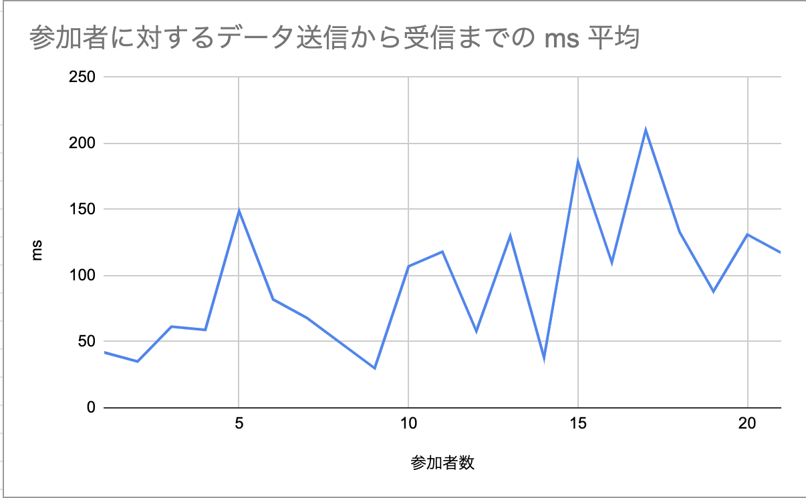
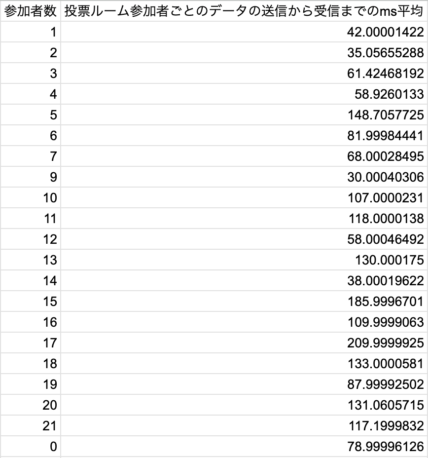

# 卒業研究発表

## WebSocketを用いた双方向通信を実現するWebアプリケーションの開発手法とその検証

### 発表者: 儀賀真周
### 所属: 神奈川大学 理学部 情報科学科
### 発表日: 2025/02/13

---
# 目次

1. 研究背景 2. 研究目的
3. 研究方法
4. 結果
5. 考察
6. 結論

---
# 研究背景

HTTPは、HTMLで書かれた情報をやり取りするための通信プロトコルであり、現代において不可欠な技術の一つである。HTTPはステートレスであり、一度のコマンド実行に一回のデータが返却される。

---
# 研究背景 (続き)

しかし、リアルタイム性が要求される遠隔講義やリモート会議にはHTTPは不向きである。WebSocketは、HTTP上でリアルタイム性を実現するための通信プロトコルであり、クライアントとサーバー間の双方向通信を可能にする。

---
# 研究目的

本研究では、WebSocket を用いることでの双方向通信の実現の容易さと有用性を測るために、実際に Webアプリケーションを開発していく。開発する内容は、事前に選択式の問題を作成し、その問題をリアルタイムで回答してもらうWebアプリケーションの作成を行う。また、WebSocket通信によるパフォーマンスの変化について検証し、WebSocketの有用性を測る。

---
# 研究方法

ここに研究方法を記述します。

---
# 結果

## 実験結果

  
  

---
# 考察

結果から、投票ルームに参加している人数、つまりWebSocket通信でサーバーにアクセスしているクライアントの数が増加するごとに、WebSocketサーバーがクライアントにデータを届けるまでに時間がかかることを表している。ただ、綺麗な右肩上がりではなく、例えば10人が投票ルームに参加していても5人の場合よりデータが届くスピードは早いため、WebSocket通信でサーバーにアクセスしているリソースが増加することでパフォーマンス低下する以外にも原因があると考えられる。いずれにせよ、データがクライアントに届くまでの最大平均msが約200msの為、WebSocketサーバーにアクセスされるリソースが20人前後では大きくパフォーマンスに影響するというわけではないようだった。ただ、ここからさらに人数が増えた場合、例えば同時接続人数が100人を超えるような場合は、通信速度に問題が出てくる可能性がある。
